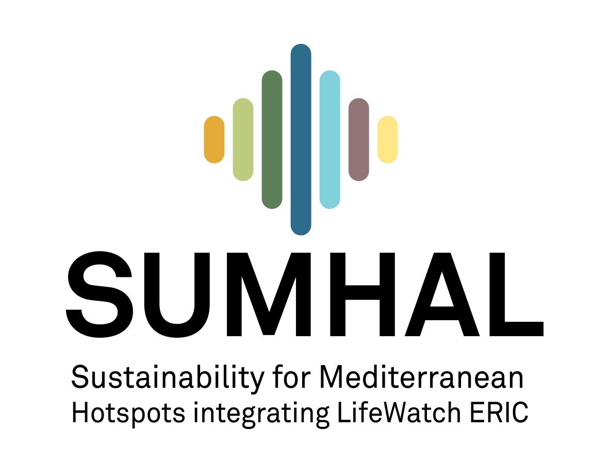

# convertGPS_cattle
### Una aplicación para el procesamiento y exploración de datos de dispositivos GPS de medición contínua para el ganado

[](https://zenodo.org/badge/latestdoi/457682829)

Este repositorio contiene varios scripts y aplicaciones para manejar y transformar datos de seguimiento de GPS del ganado. Se han desarrollado por el [SERPAM](https://www.eez.csic.es/es/evaluacion-restauracion-y-proteccion-de-agrosistemas-mediterraneos-serpam) ***Servicio de Evaluación, Restauración y Protección de Agrosistemas Mediterráneos*** de la Estación Experimental del Zaidin del CSIC (EEZ-CSIC) en el contexto del proyecto [SUMHAL](https://lifewatcheric-sumhal.csic.es/), **Sustainability for Mediterraean Hospost integrating LifeWatch ERIC**. 

## Utilización

Para utilizar las aplicaciones es necesario el uso de R. Se recomienda utilizar R-Studio. Una vez en R, es necesario descargarte el [repositorio](https://github.com/serpam/convertGPS_cattle/archive/refs/heads/main.zip), descomprimir el archivo y abrir el proyecto. Para esto último es necesario abrir el archivo `convertGPS_cattle.Rproj`. 

## Conversión de archivos

Esta aplicación realiza la conversión de archivos descargados de los dispositivos GPS de medición contínua en un formato adecuado para su tratamiento. 


### ¿Cómo ejecutarla? 

1. **En Local**. Para ejecutar la aplicación puedes abrir el archivo `scripts/run_convertidor.R` y ejecutarlo. O ejecutar en la consola:

```r
source("scripts/run_convertidor.R") 
```

2. **Online**. Esta aplicación también puedes ejecutarla [aquí](https://eez-csic.gvsigonline.com/shiny/sumhal/app_convertidor/)


## Combinar y explorar archivos de dispositivos GPS

Esta aplicación permite realizar varias operaciones sobre los archivos de los dispositivos GPS. En concreto: 

- Combinar varios archivos para su descarga como csv
- Explorar fecha de incio, fin, número de registros, etc. 
- Explorar gráficamente la cantidad de registros para cada una de las fechas. 

### ¿Cómo ejecutarla? 

1. **En Local**. Para ejecutar la aplicación puedes abrir el archivo `scripts/run_combina.R` y ejecutarlo. O también puedes ejecutar en la consola:

```r
source("scripts/run_combina.R") 
```

2. **Online**. Esta aplicación también puedes ejecutarla [aquí](https://eez-csic.gvsigonline.com/shiny/sumhal/app_combina/)

## Versión
Estas aplicaciones están en desarrollo, para cualquier duda, sugerencia o mejora, puedes abrir un [issue](https://github.com/serpam/convertGPS_cattle/issues), o contactarnos directamente.

- `v.1.0` 

### Autores <sup><a href="#fn1" id="ref1">1</a></sup>

-   [**Antonio J. Pérez-Luque**](https://github.com/ajpelu) <a href="https://orcid.org/0000-0002-1747-0469" target="orcid.widget"> </a>: Conceptualization, Data curation, Methodology, Software, Validation, Visualization

-   **Mauro J. Tognetti Barbieri**: Data curation, Methodology, Validation, and Visualization.

-   **Maria Eugenia Ramos Font** <a href="https://orcid.org/0000-0002-4888-0401" target="orcid.widget"> </a>:: Funding acquisition and Resources.

-   **Ana Belén Robles Cruz**: Funding acquisition, Project administration, Resources, and Supervision.


<sup id="fn1">1. ([CRedIT](https://credit.niso.org/) Statment)<a href="#ref1" title="Jump back to footnote 1 in the text.">↩</a></sup>


## Como citar 

Pérez-Luque, A.J.; Tognetti Barbieri, M.J.; Ramos-Font, M.E.; Robles-Cruz, A.B. (2022). convertGPS_cattle: Una aplicación para el procesamiento y exploración de datos de dispositivos GPS de medición contínua para el ganado. https://github.com/serpam/convertGPS_cattle. version 1.0. doi: [10.5281/zenodo.7347994](https://doi.org/10.5281/zenodo.7347994)

```
@misc{PerezLuque2022,
	title        = {convertGPS_cattle: Una aplicación para el procesamiento y exploración de datos 
	                de dispositivos GPS de medición contínua para el ganado},
	author       = {Pérez-Luque, Antonio Jesús and Toggnetti Barbieri, Mauro José and 
	                Ramos-Font, Maria Eugenia and Robles Cruz, Ana Belén},
	year         = {2022},
	month        = {11},
	url          = {https://github.com/serpam/convertGPS_cattle},
	version      = {1.0}
	doi          = {10.5281/zenodo.7347994}
}

```

## Financiación
Este aplicación se ha desarrollado con financiación del proyecto SUMHAL: *SUMHAL, LIFEWATCH-2019-09-CSIC-13, POPE 2014-2020* 

[](https://lifewatcheric-sumhal.csic.es/)